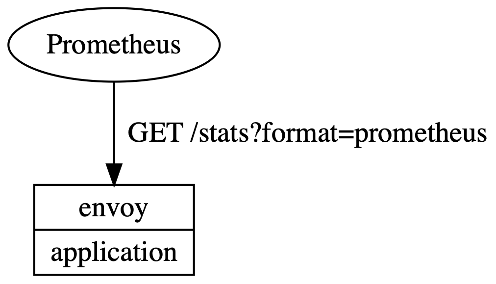

# Traffic Metrics

This resource provides a common integration point for tools that can benefit by
consuming metrics related to HTTP traffic. It follows the pattern of
`metrics.k8s.io` for instantaneous metrics that can be consumed by CLI tooling,
HPA scaling or automating canary updates.

As many of the implementations for this will be storing metrics in Prometheus,
it would be possible to just standardize on metric/label naming. This,
unfortunately, makes integration more difficult as every integration will need
to write their own Prometheus queries. For more details, see the
[tradeoffs](#tradeoffs) section.

Metrics are associated with a *resource*. These can be pods as well as higher
level concepts such as namespaces, deployments or services. All metrics are
associated with the Kubernetes resource that is either generating or serving
the measured traffic.

Pods are the most granular resource that metrics can be associated with. It is
common to look at aggregates of pods to reason about the traffic as a whole for
an application. Imagine looking at the aggregated success rate for a deployment
during canary rollouts. All resources that contain pods are aggregates of the
metrics contained within the pods. These are calculated by the implementation
itself. It is *not* possible to arbitrarily create groupings of pods to
aggregate metrics.

In addition to resources, metrics are scoped to *edges*. An edge represents
either the source of traffic or its destination. These edges restrict the
metrics to only the traffic between the `resource` and `edge.resource`.
`edge.resource` can either be general or specific. In the most general case, a
blank `edge.resource` would have metrics for all the traffic received by
`resource`.

Edges are only visible between two resources that have exchanged traffic. They
are not declarative, all traffic is monitored and can only be queried in
association with a specific resource. The list of edges for a specified resource
can be returned, it is not possible to query specific, unique edges.

Being able to query for these metrics is an important piece of the puzzle. There
are two main ways to query the API for metrics:

* The supported resources (pods, namespaces, ...) are available as part of an
  `APIResourceList`. This provides both `list` and `get` support.
* For supported resources, it is possible to use a label selector as a filter.
* A sub-resource allows querying for all the edges associated with a specific
  resource.

## Specification

The core resource is `TrafficMetrics`. It references a `resource`, has an `edge`
and surfaces latency percentiles and request volume.

```yaml
apiVersion: metrics.smi-spec.io/v1alpha1
kind: TrafficMetrics
# See ObjectReference v1 core for full spec
resource:
  name: foo-775b9cbd88-ntxsl
  namespace: foobar
  kind: Pod
edge:
  direction: to
  resource:
    name: baz-577db7d977-lsk2q
    namespace: foobar
    kind: Pod
timestamp: 2019-04-08T22:25:55Z
window: 30s
metrics:
- name: p99_response_latency
  unit: seconds
  value: 10m
- name: p90_response_latency
  unit: seconds
  value: 10m
- name: p50_response_latency
  unit: seconds
  value: 10m
- name: success_count
  value: 100
- name: failure_count
  value: 100
```

### Edge

In this example, the metrics are observed *at* the `foo-775b9cbd88-ntxsl` pod
and represent all the traffic *to* the `baz-577db7d977-lsk2q` pod. This
effectively shows the traffic originating from `foo-775b9cbd88-ntxsl` and can be
used to define a DAG of resource dependencies.

```yaml
resource:
  name: foo-775b9cbd88-ntxsl
  namespace: foobar
  kind: Pod
edge:
  direction: to
  resource:
    name: baz-577db7d977-lsk2q
    namespace: foobar
    kind: Pod
```

Alternatively, edges can also be observed *at* the `foo-775b9cbd88-ntxsl` pod
and represent all the traffic *from* the `bar-5b48b5fb9c-7rw27` pod. This
effectively shows how `foo-775b9cbd88-ntxsl` is handling the traffic destined
for it from a specific source. Just like `to`, this data can be used to define a
DAG of resource dependencies.

```yaml
resource:
  name: foo-775b9cbd88-ntxsl
  namespace: foobar
  kind: Pod
edge:
  direction: from
  resource:
    name: bar-5b48b5fb9c-7rw27
    namespace: foobar
    kind: Pod
```

Finally, `resource` can be as general or specific as desired. For example, with
a `direction` of `to` and an empty `resource`, the metrics represent all the
traffic received by the `foo-775b9cbd88-ntxsl` pod.

```yaml
resource:
  name: foo-775b9cbd88-ntxsl
  namespace: foobar
  kind: Pod
edge:
  direction: to
  resource: {}
```

Note: `resource` could also contain only a namespace to select any traffic from
that namespace or only `kind` to select specific types of incoming traffic.

Note: there is no requirement that metrics are actually being collected for
resources selected by edges. As metrics are always observed *at* `resource`, it
is possible to construct these entirely from the resource.

### TrafficMetricsList

There are three different ways to get a TrafficMetricsList:

* Requesting a specific `kind` such as pods or namespaces.

    ```yaml
    apiVersion: metrics.smi-spec.io/v1alpha1
    kind: TrafficMetricsList
    resource:
      kind: Pod
    items:
    ...
    ```

    Note: the values for `resource` would only be `kind`, `namespace` and
    `apiVersion`.

* Requesting a specific `kind` such as pods and filtering with a label selector:

    ```yaml
    apiVersion: metrics.smi-spec.io/v1alpha1
    kind: TrafficMetricsList
    resource:
      kind: Pod
    selector:
      matchLabels:
        app: foo
    items:
    ...
    ```

    Note: the label selector does *not* filter the metrics themselves, only the
    items that show up in the list.

* Listing all the edges for a specific resource:

    ```yaml
    apiVersion: metrics.smi-spec.io/v1alpha1
    kind: TrafficMetricsList
    resource:
      name: foo-775b9cbd88-ntxsl
      namespace: foobar
      kind: Pod
    selector:
      matchLabels:
        app: foo
    items:
    ...
    ```

    Note: this specific list is a sub-resource of `foo-775b9cbd88-ntxsl` from an
    API perspective.

### Kubernetes API

The `traffic.metrics.k8s.io` API will be exposed via a `APIService`:

```yaml
apiVersion: apiregistration.k8s.io/v1
kind: APIService
metadata:
  name: v1beta1.metrics.smi-spec.io
spec:
  group: metrics.smi-spec.io/v1alpha1
  service:
    name: mesh-metrics
    namespace: default
  version: v1beta1
```

The default response, or requesting `/apis/metrics.smi-spec.io/v1alpha1/`
would return:

```yaml
apiVersion: v1
kind: APIResourceList
groupVersion: metrics.smi-spec.io/v1alpha1
resources:
- name: namespaces
  namespaced: false
  kind: TrafficMetrics
  verbs:
  - get
  - list
- name: deployments
  namespaced: true
  kind: TrafficMetrics
  verbs:
  - get
  - list
...
- name: pods
  namespaced: true
  kind: TrafficMetrics
  verbs:
  - get
  - list
```

The full list of resources for this list would be:

* namespaces
* nodes
* pods
* replicationcontrollers
* services
* daemonsets
* deployments
* replicasets
* statefulsets
* jobs

For resource types that contain `pods`, such as `namespaces` and `deployments`,
the metrics are aggregates of the `pods` contained within.

## Use Cases

### Top

Like `kubectl top`, a plugin could be written such as `kubectl traffic top` that
shows the traffic metrics for resources.

```bash
$ kubectl traffic top pods
NAME                        SUCCESS      RPS   LATENCY_P99
foo-6846bf6b-gjmvz          100.00%   1.8rps           1ms
bar-f84f44b5b-dk4g9          75.47%   0.9rps           1ms
baz-69c8bb6d5b-gn5rt         86.67%   1.8rps           2ms
```

Implementation of this command would be a simple conversion of the API's
response of a `TrafficMetricsList` into a table for display on the command line
or a dashboard.

### Canary

In combination with the TrafficSplit specification, a controller can:

* Create a new deployment `v2`.
* Add a new canary and service for `v2`.
* Update the canary definition to send some traffic to `v2`.
* Monitor for success rate to drop below 100%. If it does, rollback.
* Update the canary definition to route more traffic.
* Loop until all traffic is on `v2`.

### Topologies

Following the concept of `kubectl traffic top`, there could also be a
`kubectl traffic topology` command. This could provide ascii graphs of the
topology between applications. Alternative outputs could be graphviz's DOT
language.

```bash
$ kubectl traffic topology deployment
                  +-------------------------------+
                  |                               v
+---------+     +--------+     +---------+      +-------+
| traffic | --> | foo    | --> | bar     | <--> | baz   |
+---------+     +--------+     +---------+      +-------+
```

Implementation of this command would require multiple queries, one to get the
list of all deployments and another to get the edges for each of those
deployments. While this example shows command line usage, it should be
possible for dashboards such as Kiali to be built entirely on top of this API.

## RBAC

* View metrics for all resources and edges.

    ```yaml
    apiVersion: rbac.authorization.k8s.io/v1beta1
    kind: Role
    metadata:
      name: traffic-metrics
    rules:
    - apiGroups:
      - traffic.metrics.k8s.io
      resources: ["*"]
      verbs: ["*"]
    ```

* View only the metrics for edges of pods.

    ```yaml
    apiVersion: rbac.authorization.k8s.io/v1beta1
    kind: Role
    metadata:
      name: traffic-metrics
    rules:
    - apiGroups:
      - traffic.metrics.k8s.io
      resources: ["pods/edges"]
      verbs: ["*"]
    ```

## Example implementation

This example implementation is included to illustrate how `TrafficMetrics` are
surfaced. It does *not* prescribe a particular implementation. This example also
does not serve as an example of how to consume the metrics provided.


For this example implementation, metrics are being stored in Prometheus. These
are being scraped [from Envoy](#envoy-mesh) periodically. The only component in
this architecture that is custom is the `Traffic Metrics Shim`. All others do
not require any modification.

The shim maps from Kubernetes native API standards to the Prometheus store which
is an implementation detail of the service mesh. As the shim itself is doing the
mapping, any backend metrics store could be used.

Walking through the request flow:

1. An end user fires off a request to the Kubernetes API Server:

    ```bash
    kubectl get --raw /apis/metrics.smi-spec.io/v1alpha1/namespaces/default/deployments/
    ```

1. The Kubernetes API server forwards this request to the `Traffic Metrics
Shim`.

1. The shim issues multiple requests to Prometheus. An example for the total
   requests grouped by success and failure would be:

    ```plain
    sum(requests_total{namespace='default',kind='deployment'}) by (name, success)
    ```

    Note: there are multiple queries required here to fetch all the metrics for
    a response.

1. On receiving the responses from Prometheus, the shim converts the values into
   a `TrafficMesh` object for consumption by the end user.

### Envoy Mesh



While the mesh itself is outside the scope of this example, it is valuable to
see that piece of the architecture as well. Prometheus has a scrape config that
targets pods with an Envoy sidecar and periodically requests
`/stats?format=prometheus`.

## Tradeoffs

* APIService - it would be possible to simply be proscriptive of metrics and
  label names for Prometheus, configure many of these responses as recording
  rules and force integrations to query those directly. This feels like it
  increases the bar for metrics stores to change their internal configuration
  around to support this specification. There is also not a multi-tenant story
  for Prometheus series visibility that maps across Kuberenetes RBAC. From the
  other side, consumers of these metrics will have to do discovery of
  Prometheus' location in the cluster and do some kind of queries to surface the
  data that they need.

* Edges - while it is valuable to see all the traffic metrics associated with a
  specific resource, debugging regularly requires understanding the path that
  traffic is taking between specific resources. Additionally, seeing the edges
  opens up a new set of integrations such as topology graphs and more flexible
  canary policy.

* Aggregation - being able to look at metrics across higher level concepts such
  as deployments (imagine tracking v2 of a deployment during a canary rollout).
  These are hard to aggregate without access to the underlying data and so it is
  valuable to access the data pre-aggregated from the API perspective.

* `custom.metrics` vs `metrics` styles - this API groups metrics together by
  resource. The `custom.metrics.k8s.io` API presents a long list of metrics with
  names that suggest the resource. Because the primary use is to fetch a group
  of metrics associated with a resource, this API matches the `metrics.k8s.io`
  style a little bit more.

* Counts - most users will want to see RPS and success rates instead of raw
  counts. As these are trivial to calculate from success/failure counts and
  cover up some important data, counts are being used.

## Out of scope

* Edge aggregation - it would be valuable to get a resource such as a pod and
  see the edges for other aggregates such as deployments. For now, the queries
  to do this are not defined.
* Label selectors - this API uses label selectors to impact filtering of
  resources and does not use these selectors for the actual metric series. Using
  the selectors against metric series is very valuable, imagine getting
  per-route metrics surfaced.
* Historical data - while this API *could* support delivering historical data,
  it is not called out explicitly right now. The primary use cases currently are
  immediate requirements: how is the canary rollout going? what is my topology?
  what is happening to my application right now?

## Open Questions

* stddev - the best integration for canary deployments or things like HPA would
  be surfacing the stddev of metrics. Then, monitoring could be +/- outside of
  the last measurements. This API is not particularly well setup to surface
  these numbers and it might not be as useful as they look.
